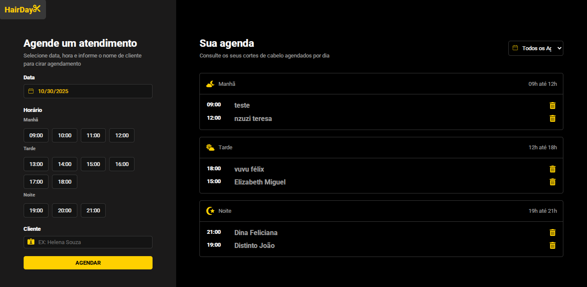

# 🌟 HairDay - Sistema de Agendamento e Gestão de Agenda

O **HairDay** é uma aplicação web moderna e intuitiva, desenvolvida em React, focada em simplificar o agendamento de serviços de beleza (cortes de cabelo) e a gestão diária da agenda. Utiliza uma interface limpa e escura que facilita a visualização dos compromissos por período (Manhã, Tarde e Noite).



## ✨ Principais Funcionalidades

O projeto é dividido em duas áreas principais, refletidas no layout de dois painéis na interface:

### 1. Painel de Agendamento (Esquerda)

Permite ao usuário (ou administrador) cadastrar novos agendamentos de forma rápida e precisa.

**Seleção de Data:** Campo de calendário dedicado para selecionar o dia do agendamento (10/30/2025 no exemplo).

**Seleção de Horário:** Botões interativos para escolher o horário dentro de três períodos definidos (Manhã, Tarde, Noite).

**Identificação do Cliente:** Campo para inserir o nome do cliente.

**Criação:** Botão AGENDAR para submeter e salvar o novo compromisso.

### 2. Painel de Agenda (Direita)

Permite ao administrador consultar e gerenciar os agendamentos já cadastrados.

**Visualização por Período:** A agenda é automaticamente dividida em seções: Manhã (09h até 12h), Tarde (12h até 18h) e Noite (19h até 21h).

**Listagem de Agendamentos:** Cada compromisso exibe o horário e o nome do cliente.

**Funcionalidade de Exclusão:** Ícone de lixeira (🗑️) ao lado de cada agendamento para facilitar a remoção rápida.

**Filtro por Data (Destaque):** 

- Dropdown "Todos os Agendamentos" (ou por data específica) no topo, que permite consultar os agendamentos de um dia específico.

- Funcionalidade de Filtragem desenvolvida com useState e filter para atualizar dinamicamente a agenda exibida.

## 🚀 Tecnologias Utilizadas

Este projeto foi construído utilizando as seguintes tecnologias de ponta do desenvolvimento Front-end:

| Categoria | Tecnologia | Objetivo |
| :--- | :--- | :--- |
| Framework/Biblioteca | React.js | Criação da interface de usuário reativa e base do projeto. |
| Criação do Projeto | Vite | Ferramenta de build rápida para o ambiente de desenvolvimento. |
| Estilização | CSS Padrão | Responsável pela estética Dark Mode e layout flexível. | 
| Gerenciamento de Estado | useState e useContext | Para armazenar os dados dos agendamentos e gerenciar o estado global da aplicação. | 
| Ícones | react-icons | Utilizado para ícones como o calendário (CiCalendar). |

## ⚙️ Como Executar Localmente

### 1. Clone o repositório:

```Bash
git clone [SEU_LINK_DO_REPOSITÓRIO]
cd [pasta-do-projeto]
```

### 2. Instale as dependências:

```Bash
npm install
# ou yarn install
```

### 3. Inicie o servidor de desenvolvimento:

```Bash
npm run dev
# ou yarn dev
```

4. Abra seu navegador e acesse a URL local fornecida pelo Vite (ex: http://localhost:5173).